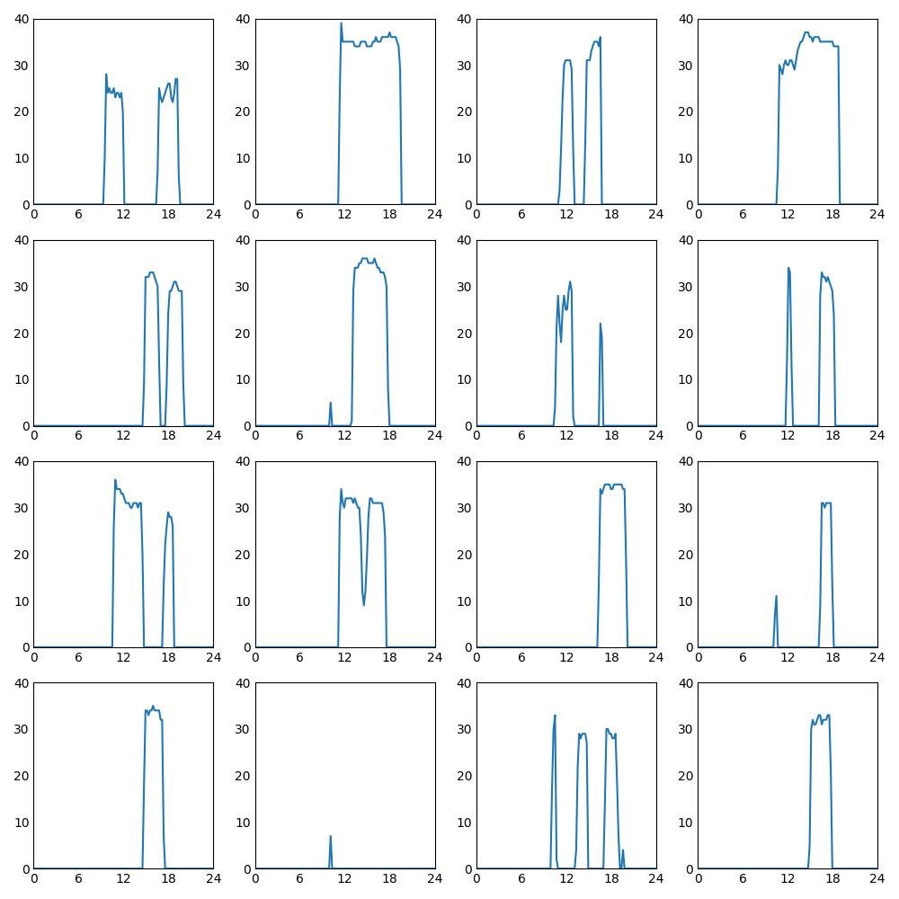

# WaveGenerator

人工的な波形をGANで作成してみるテスト

# Abstract

1日の電力使用量の時系列データが存在する．


この波形に似たものを，Generatorで生成することができるかという問題を扱う．瞬間的にレベルが上昇し，そのレベルを一定時間維持した後レベルが落ちるようなグラフである．（横スライドと呼称している）．

5000イテレーション学習させたジェネレータで出力させると，以下のようになる．



## Environments

* python3
* keras
* matplotlib
* pandas
* tqdm
* numpy
* tensorflow

## Run

```
$ python3 visualize.py
$ python3 main_noise.py --train --test
```

## Data

1. Remove ZERO data
2. Normalize
3. Outlier

詳細はmain_noise.pyのX_train_generate()
